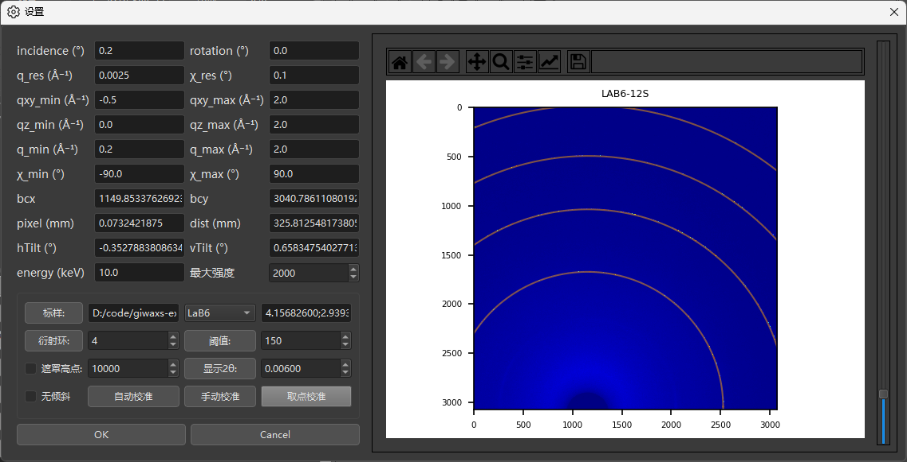
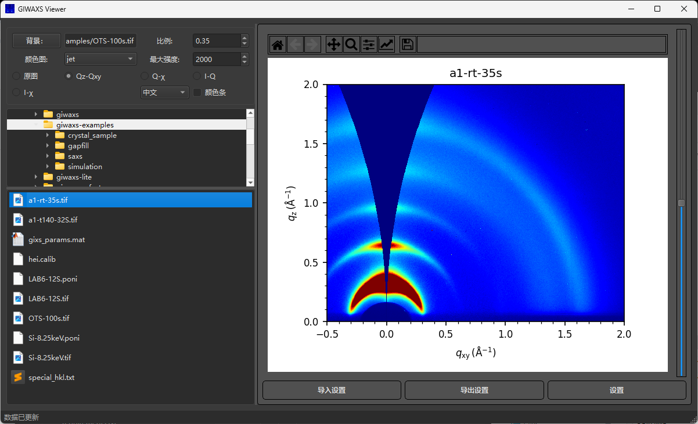

# GIWAXS-Viewer

本软件为 GIWAXS数据实时预览软件，可将原始图像转化成 qz-qxy 二维图和一维积分。

## 引用

使用本软件请引用：

> Jianyao Huang, GIWAXS-Viewer,  https://gitee.com/swordshinehjy/giwaxs-script .

请在您的出版物中引用此软件，这将有助于我们更好地改进和维护它。

## 使用方法

*   设置参数

*   选择模式，点击即可实时预览

## 免责声明

作者尽可能保证代码的准确性，但 **不能保证没有内部错误**。

**重要提示：**

*   如果您在使用过程中发现任何 bug，请及时汇报，以便我们进行修复。
*   主要源代码请参照上述网址 [https://gitee.com/swordshinehjy/giwaxs-script](https://gitee.com/swordshinehjy/giwaxs-script)。
*   **作者不对软件给出的结果所导致的任何后果负责。使用本软件所产生的一切风险由用户自行承担。**

请仔细阅读免责声明，并在充分理解的基础上使用本软件。

## 更新地址（不定期）

您可以通过以下链接获取软件的最新版本和更新：

*   **百度网盘:**  [https://pan.baidu.com/s/1TlP4NTln2Tf3MxHLwq9MNA?pwd=0000](https://pan.baidu.com/s/1TlP4NTln2Tf3MxHLwq9MNA?pwd=0000)  密码: `0000`
*   **阿里云盘:** [https://www.aliyundrive.com/s/Gw2CmNNK6vw](https://www.aliyundrive.com/s/Gw2CmNNK6vw)

建议您不定期访问这些链接，以获取软件的最新版本和功能。

---

感谢您使用 GIWAXS-Tools 软件！ 如有任何问题或建议，欢迎联系作者。